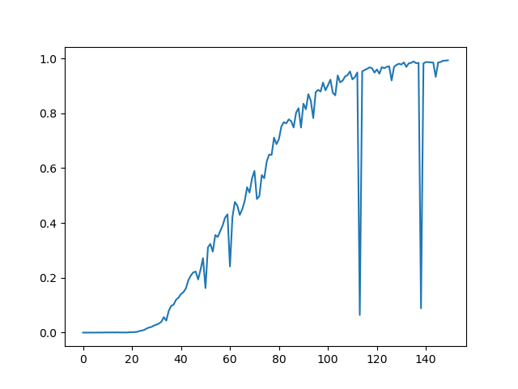
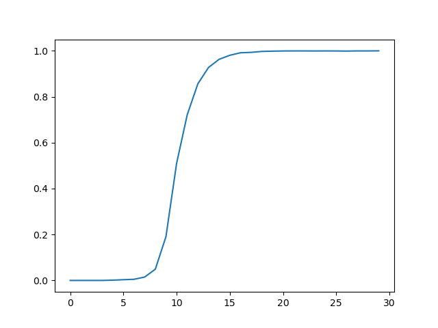
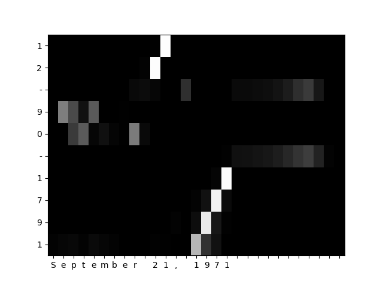

# CAP 8

---

## 1.WeightSum

```python
class WeightSum(torch.nn.Module):
    def __init__(self):
        super(WeightSum, self).__init__()
        pass

    def forward(self, hs, p):
        B, L, H = hs.shape

        p = p.reshape(B, L, 1).repeat(1, 1, H)
        outs = hs * p
        outs = outs.sum(dim=1)

        return outs

```

---

## 2.AttentionWeight

```python
class AttentionWeight(torch.nn.Module):
    def __init__(self):
        super(AttentionWeight, self).__init__()
        self.softmax = torch.nn.Softmax()
    
    def forward(self, hs, hn):
        # hs (B, L, H)
        # hn (B,H)
        B, L, H = hs.shape
        hn = hn.reshape(B, 1, H)
        hn = hn.repeat(1, L, 1)

        outs = hs * hn  # outs.shape: (B, L, H)
        outs = outs.sum(dim=2)  # outs.shape: (B, L)
        outs = self.softmax(outs)

        return outs

```

---

## 3.Attention

```python
class Attention(torch.nn.Module):
    def __init__(self):
        super(Attention, self).__init__()
        self.attentionWeight = AttentionWeight()
        self.weightSum = WeightSum()

    def forward(self, hs, hn):
        p = self.attentionWeight(hs, hn)  # p.shape: (B, L)
        outs = self.weightSum(hs, p)  # outs.shape: (B, H)

        return outs
    
```

---

## 4.Calculator

```python
import torch

import numpy as np

from torch.utils.data import Dataset
from torch.utils.data import DataLoader

from util import *
import sequence
import ptb

WORD_SIZE = 16
HIDDEN_SIZE = 128
BATCH_SIZE = 64
EPOCH = 20

cpu = torch.device('cpu')
gpu = torch.device('cuda:0')


class MyDataset(Dataset):
    def __init__(self, questions, answers):
        # questions:(N, L_q)
        # answers:(N, L_a)
        self.questions = torch.LongTensor(questions)
        self.answers = torch.LongTensor(answers)

        self.questions = self.questions.flip(dims=[1])  # reverse
        self.answers = self.answers.flip(dims=[1])  # reverse

        self.len = len(questions)

    def __getitem__(self, index):
        return self.questions[index], self.answers[index]
    
    def __len__(self):
        return self.len


class Encoder(torch.nn.Module):
    def __init__(self, vocab_size, wordvec_size, hidden_size) -> None:
        super(Encoder, self).__init__()
        V, D, H = vocab_size, wordvec_size, hidden_size
        self.embed = torch.nn.Embedding(num_embeddings=V, embedding_dim=D)
        self.lstm = torch.nn.LSTM(input_size=D, hidden_size=H)
    
    def forward(self, xs):
        # (N, L)
        xs = self.embed(xs)  # (N, L, D)
        xs = xs.permute(1, 0, 2)
        
        outs, (hn, cn) = self.lstm(xs)
        # return hn  # bi*num_layers, N, H
        return outs, hn  # outputs.shape: (L, B, H) D = 2 if bidirectional == True
    

class AttentionWeight(torch.nn.Module):
    def __init__(self):
        super(AttentionWeight, self).__init__()
        self.softmax = torch.nn.Softmax(dim=2)
    
    def forward(self, enc_hs, dec_hs):
        # enc_hs (N, L_q, H)
        # dec_hs (L_a, N, H) 
        N, L_q, H = enc_hs.shape
        L_a = dec_hs.shape[0]

        '''
        tmp = torch.zeros(L_a, N, L_q)
        for i in range(L_a):
            t = torch.sum(enc_hs * (dec_hs[i].reshape(N, 1, H).repeat(1, L_q, 1)), dim=2)
            tmp[i] = t
        tmp = tmp.to(gpu)
        tmp = self.softmax(tmp)
        '''

        enc_hs = enc_hs.reshape(1, N, L_q, H).repeat(L_a, 1, 1, 1)  # enc_hs: (L_a, N, L_q, H)
        dec_hs = dec_hs.reshape(L_a, N, 1, H).repeat(1, 1, L_q, 1)  # dec_hs (L_a, N, L_q, H)

        outs = enc_hs * dec_hs  # outs (L_a, N, L_q, H)
        outs = outs.sum(dim=3)  # outs (L_a, N, L_q)
        outs = self.softmax(outs)  # outs.shape: (L_a, N, L_q)
        
        print(outs.sum(dim=0))
        print(outs.sum(dim=2))

        return outs


class WeightSum(torch.nn.Module):
    def __init__(self):
        super(WeightSum, self).__init__()
        pass

    def forward(self, hs, p):
        # hs: (N, L_q, H)
        # p: (L_a, N, L_q)
        N, H = hs.shape[0], hs.shape[2]
        L_a, L_q = p.shape[0], p.shape[2]
        hs = hs.reshape(1, N, L_q, H).repeat(L_a, 1, 1, 1)  # hs: (L_a, N, L_q, H)

        p = p.reshape(L_a, N, L_q, 1).repeat(1, 1, 1, H)  # p: (L_a, N, L_q, H)
        outs = hs * p  # outs: (L_a, N, L_q, H)
        outs = outs.sum(dim=2)  # outs.shape: (L_a, N, H)

        return outs
        

class Attention(torch.nn.Module):
    def __init__(self):
        super(Attention, self).__init__()
        self.attentionWeight = AttentionWeight()
        self.weightSum = WeightSum()

    def forward(self, enc_hs, dec_hs):
        # enc_hs, dec_hs: (N, L_q, H), (N, L_a, H)
        p = self.attentionWeight(enc_hs, dec_hs)  # p.shape: (L_a, N, L_q)
        outs = self.weightSum(enc_hs, p)  # outs.shape: (L_a, N, H)

        return outs


class Decoder(torch.nn.Module):
    def __init__(self, vocab_size, wordvec_size, hidden_size) -> None:
        super(Decoder, self).__init__()
        V, D, H = vocab_size, wordvec_size, hidden_size
        self.embed = torch.nn.Embedding(num_embeddings=V, embedding_dim=D)
        self.lstm = torch.nn.LSTM(input_size=D, hidden_size=H)
        self.attention = Attention()
        self.fc = torch.nn.Linear(in_features=H+H, out_features=V)
    
    def forward(self, ts, enc_hs, hn):
        # xs:(N, L), hn: (1, N, H)
        enc_hs = enc_hs.permute(1, 0, 2)  # hs.shape: (N, L, H)
        
        ts = self.embed(ts)  # (N, L_a, D)
        ts = ts.permute(1, 0, 2)  # (L_a, N, D)

        cn = torch.zeros_like(hn)
        dec_hs, (h, c) = self.lstm(ts, (hn, cn))  # dec_hs:(L_a, N, H)

        # hs: (N, L_q, H)
        outs_attention = self.attention(enc_hs, dec_hs)  # outs_attention: (L_a, N, H)
        outs = torch.concat([outs_attention, dec_hs], dim=2)  # outs: (L_a, N, H+H)

        outs = self.fc(outs)  # (L_a, N, V)
        outs = outs.permute(1, 0, 2)
        return outs


class Seq2seq(torch.nn.Module):
    def __init__(self):
        super(Seq2seq, self).__init__()
        self.encoder = Encoder(vocab_size, WORD_SIZE, HIDDEN_SIZE)
        self.decoder = Decoder(vocab_size, WORD_SIZE, HIDDEN_SIZE)
    
    def forward(self, xs, decoder_xs):
        # xs: (N, L_q)
        # ts: (N, L_a)
        hs, hn = self.encoder(xs)  # hs.shape: (L, B, H)
        outs = self.decoder(decoder_xs, hs, hn)

        return outs  # (N, L, V)


(x_train, t_train), (x_test, t_test) = \
    sequence.load_data('addition.txt', seed=1984)
char2id, id2char = sequence.get_vocab()
vocab_size = len(char2id)

train_dataset = MyDataset(x_train, t_train)
train_loader = DataLoader(dataset=train_dataset, batch_size=BATCH_SIZE, shuffle=True)
test_dataset = MyDataset(x_test, t_test)
test_loader = DataLoader(dataset=test_dataset, batch_size=BATCH_SIZE, shuffle=False)
test_data_len = len(test_dataset)

model = Seq2seq().to(gpu)
criterion = torch.nn.CrossEntropyLoss(reduction='mean')
optimizer = torch.optim.Adam(model.parameters(), lr=0.0002)

correct_rate_list = []
for epoch in range(EPOCH):
    epoch_mean_loss = 0
    for idx, my_data in enumerate(train_loader, 0):
        xs, ts = my_data
        xs, ts = xs.to(gpu), ts.to(gpu)
        # xs: (N, L_q) ts: (N, L_a)
        decoder_xs, decoder_ts = ts[:, :-1], ts[:, 1:]
        outs = model(xs, decoder_xs)  # (N, L, V)
        outs = outs.reshape(-1, vocab_size)
        decoder_ts = decoder_ts.flatten()
        loss = criterion(outs, decoder_ts)
        epoch_mean_loss += loss.item()

        optimizer.zero_grad()
        loss.backward()
        optimizer.step()

    print(f"Epoch={epoch}, epoch_mean_loss={epoch_mean_loss / len(train_loader)}")

    with torch.no_grad():
        correct_cnt = 0
        for idx, test__data in enumerate(test_loader, 0):
            test_xs, test_ts = test__data  # xs: (N, L_q) ts: (N, L_a)
            test_xs, test_ts = test_xs.to(gpu), test_ts.to(gpu)
            test_decoder_xs, test_decoder_ts = test_ts[:, :-1], test_ts[:, 1:]
            outs = model(test_xs, test_decoder_xs)  # (N, L, V)
            outs = outs.argmax(dim=2)  # (N, L)
            # test_decoder_ts: (N, L)
            for idx_batch, (test_x, out, test_decoder_t) in enumerate(zip(test_xs, outs, test_decoder_ts), 0):
                if (out.equal(test_decoder_t)):
                    correct_cnt += 1
                '''
                if (idx_batch < 5):
                    quest_str = ''
                    pred_str = ''
                    ans_str = ''
                    for i in test_x.tolist():
                        quest_str += id2char[i]
                    for j, z in zip(out.tolist(), test_decoder_t.tolist()):
                        pred_str += id2char[j]
                        ans_str += id2char[z]
                    print(quest_str)
                    print(pred_str)
                    print(ans_str)
                    print('----')
                '''
        correct_rate_list.append(correct_cnt / test_data_len)
        print(f'Epoch={epoch}, correct rate={correct_cnt / test_data_len}')

draw_pict(correct_rate_list, 0, EPOCH)


```

---

## 5.Date Transform

```python
import torch

import numpy as np

from torch.utils.data import Dataset
from torch.utils.data import DataLoader

from util import *
import sequence
import ptb

WORD_SIZE = 16
HIDDEN_SIZE = 128
BATCH_SIZE = 256
EPOCH = 30
BIDIRECTIONAL = False
NUM_LAYERS = 1
DROPOUT = 0
DIM_forP = 2

cpu = torch.device('cpu')
gpu = torch.device('cuda:0')


class MyDataset(Dataset):
    def __init__(self, questions, answers):
        # questions:(N, L_q)
        # answers:(N, L_a)
        self.questions = torch.LongTensor(questions)
        self.answers = torch.LongTensor(answers)

        self.questions = self.questions.flip(dims=[1])  # reverse inputs

        self.len = len(questions)

    def __getitem__(self, index):
        return self.questions[index], self.answers[index]
    
    def __len__(self):
        return self.len


class Encoder(torch.nn.Module):
    def __init__(self, vocab_size, wordvec_size, hidden_size, bidirectional=False, num_layers=1) -> None:
        super(Encoder, self).__init__()
        V, D, self.H = vocab_size, wordvec_size, hidden_size
        self.bi = bidirectional
        self.num_layers = num_layers
        self.embed = torch.nn.Embedding(num_embeddings=V, embedding_dim=D)
        self.lstm = torch.nn.LSTM(input_size=D, hidden_size=self.H, bidirectional=self.bi, 
                                  num_layers=self.num_layers, dropout=DROPOUT)
    
    def forward(self, xs):
        # (N, L)
        N = xs.shape[0]
        xs = self.embed(xs)  # (N, L, D)
        xs = xs.permute(1, 0, 2)  # (L, N, D)

        # xs: L, N, H_{in}
        # h_0: D * num_layers, N, H_{out}
        # c_0: D * num_layers, N, H_{cell}

        # outs: L, N, D * H_{out}, D * H_{out}:(forward, reverse)
        # h_n: D * num_layers, N, H_{out}, D * num_layers: (layer1's forward, layer1's reverse, layer2's forward, layer2's reverse)
        # c_n: D * num_layers, N, H_{cell}
        h_0 = torch.zeros(self.num_layers * (2 if self.bi else 1), N, self.H).to(gpu)
        c_0 = torch.zeros_like(h_0).to(gpu)
        outs, (hn, cn) = self.lstm(xs, (h_0, c_0))
        # print(outs[-1, -1, :HIDDEN_SIZE].eq(hn[-2, -1]))
        # print(outs[0, -1, HIDDEN_SIZE:].eq(hn[-1, -1]))
        # print(outs[-1, -1, :HIDDEN_SIZE].equal(hn[-2, -1]))
        # print(outs[0, -1, HIDDEN_SIZE:].equal(hn[-1, -1]))
        
        # if bidirectional is True
        #outs = (outs[:, :, :self.H] + outs[:, :, self.H:]) * 0.5
        #hn = ((hn[-1] + hn[-2]) * 0.5).reshape(1, N, self.H)
        
        return outs, hn
    

class AttentionWeight(torch.nn.Module):
    def __init__(self):
        super(AttentionWeight, self).__init__()
        self.softmax = torch.nn.Softmax(dim=DIM_forP)
    
    def forward(self, enc_hs, dec_hs):
        # enc_hs (N, L_q, H)
        # dec_hs (L_a, N, H) 
        N, L_q, H = enc_hs.shape
        L_a = dec_hs.shape[0]

        '''
        tmp = torch.zeros(L_a, N, L_q)
        for i in range(L_a):
            t = torch.sum(enc_hs * (dec_hs[i].reshape(N, 1, H).repeat(1, L_q, 1)), dim=2)
            tmp[i] = t
        tmp = tmp.to(gpu)
        tmp = self.softmax(tmp)
        '''

        enc_hs = enc_hs.reshape(1, N, L_q, H).repeat(L_a, 1, 1, 1)  # enc_hs: (L_a, N, L_q, H)
        dec_hs = dec_hs.reshape(L_a, N, 1, H).repeat(1, 1, L_q, 1)  # dec_hs (L_a, N, L_q, H)

        outs = enc_hs * dec_hs  # outs (L_a, N, L_q, H)
        outs = outs.sum(dim=3)  # outs (L_a, N, L_q)
        outs = self.softmax(outs)  # outs.shape: (L_a, N, L_q)

        return outs


class WeightSum(torch.nn.Module):
    def __init__(self):
        super(WeightSum, self).__init__()
        pass

    def forward(self, hs, p):
        # hs: (N, L_q, H)
        # p: (L_a, N, L_q)
        N, H = hs.shape[0], hs.shape[2]
        L_a, L_q = p.shape[0], p.shape[2]
        hs = hs.reshape(1, N, L_q, H).repeat(L_a, 1, 1, 1)  # hs: (L_a, N, L_q, H)

        p = p.reshape(L_a, N, L_q, 1).repeat(1, 1, 1, H)  # p: (L_a, N, L_q, H)
        outs = hs * p  # outs: (L_a, N, L_q, H)
        outs = outs.sum(dim=2)  # outs.shape: (L_a, N, H)

        return outs
        

class Attention(torch.nn.Module):
    def __init__(self):
        super(Attention, self).__init__()
        self.attentionWeight = AttentionWeight()
        self.weightSum = WeightSum()

    def forward(self, enc_hs, dec_hs):
        # enc_hs, dec_hs: (N, L_q, H), (N, L_a, H)
        p = self.attentionWeight(enc_hs, dec_hs)  # p.shape: (L_a, N, L_q)
        outs = self.weightSum(enc_hs, p)  # outs.shape: (L_a, N, H)

        return outs, p


class Decoder(torch.nn.Module):
    def __init__(self, vocab_size, wordvec_size, hidden_size) -> None:
        super(Decoder, self).__init__()
        self.V, D, self.H = vocab_size, wordvec_size, hidden_size
        self.embed = torch.nn.Embedding(num_embeddings=self.V, embedding_dim=D)
        self.lstm = torch.nn.LSTM(input_size=D, hidden_size=self.H)
        self.attention = Attention()
        #self.fc = torch.nn.Linear(in_features=self.H, out_features=self.V)
        self.fc = torch.nn.Linear(in_features=self.H+self.H, out_features=self.V)  # attention
        self.attention_p = None

    def forward(self, ts, enc_hs, hn, is_train=True, start_id=None, L_a=None):
        if (is_train):
            # xs:(N, L), hn: (1, N, H)
            enc_hs = enc_hs.permute(1, 0, 2)  # hs.shape: (N, L, H)
            
            ts = self.embed(ts)  # (N, L_a, D)
            ts = ts.permute(1, 0, 2)  # (L_a, N, D)

            cn = torch.zeros_like(hn)
            dec_hs, (h, c) = self.lstm(ts, (hn, cn))  # dec_hs:(L_a, N, H)

            # hs: (N, L_q, H)
            outs_attention, self.attention_p = self.attention(enc_hs, dec_hs)  # outs_attention: (L_a, N, H)  # attention
            outs = torch.concat([outs_attention, dec_hs], dim=2)  # outs: (L_a, N, H+H)  # attention

            #outs = self.fc(dec_hs)  # (L_a, N, V)
            outs = self.fc(outs)  # (L_a, N, V)  # attention
            outs = outs.permute(1, 0, 2)  # (N, L_a, V)
            return outs
        else:
            # enc_hs:(L_q, N, H), hn: (1, N, H)
            L_q, N = enc_hs.shape[0], enc_hs.shape[1]
            enc_hs = enc_hs.permute(1, 0, 2)  # hs.shape: (N, L, H)
            cn = torch.zeros_like(hn).to(gpu)

            outs = torch.empty(L_a, N, self.V).to(gpu)
            self.attention_p = torch.empty(L_a, N, L_q).to(gpu)

            # start_id: char2id['_']
            sample_id = start_id
            sample_id = torch.tensor([sample_id]).to(gpu)
            sample_id = sample_id.repeat(N)  # (N, )

            for idx in range(L_a):
                xs = sample_id.reshape(N, 1)
                xs = self.embed(xs)  # (N, 1, D)
                xs = xs.permute(1, 0, 2)  # (1, N, D)

                dec_hs, (hn, cn) = self.lstm(xs, (hn, cn))  # dec_hs:(L_a, N, H)

                # hs: (N, L_q, H)
                out_attention, p = self.attention(enc_hs, dec_hs)  # out_attention: (1, N, H)  # attention
                out = torch.concat([out_attention, dec_hs], dim=2)  # out: (1, N, H+H)  # attention

                #outs = self.fc(dec_hs)  # (L_a, N, V)
                out = self.fc(out)  # (1, N, V)
                out = out.reshape(N, self.V)  # (N, V)
                outs[idx] = out
                self.attention_p[idx] = p

                out = out.argmax(dim=1)  # (N,)
                sample_id = out  # (N,)

            outs = outs.permute(1, 0, 2)
            return outs


class Seq2seq(torch.nn.Module):
    def __init__(self):
        super(Seq2seq, self).__init__()
        self.encoder = Encoder(vocab_size, WORD_SIZE, HIDDEN_SIZE, BIDIRECTIONAL, NUM_LAYERS)
        self.decoder = Decoder(vocab_size, WORD_SIZE, HIDDEN_SIZE)
    
    def forward(self, xs, decoder_xs=None, is_train=True, start_id=None, L_a=None):
        # xs: (N, L_q)
        # ts: (N, L_a)
        enc_hs, hn = self.encoder(xs)  # hs.shape: (L, B, H)
        outs = self.decoder(ts=decoder_xs, enc_hs=enc_hs, hn=hn, 
                            is_train=is_train, start_id=start_id, L_a=L_a)

        return outs  # (N, L, V)


(x_train, t_train), (x_test, t_test) = \
    sequence.load_data('date.txt', seed=1984)

char2id, id2char = sequence.get_vocab()
vocab_size = len(char2id)

train_dataset = MyDataset(x_train, t_train)
train_loader = DataLoader(dataset=train_dataset, batch_size=BATCH_SIZE, shuffle=True)
test_dataset = MyDataset(x_test, t_test)
test_loader = DataLoader(dataset=test_dataset, batch_size=BATCH_SIZE, shuffle=False)
test_data_len = len(test_dataset)

model = Seq2seq().to(gpu)
criterion = torch.nn.CrossEntropyLoss(reduction='mean')
optimizer = torch.optim.Adam(model.parameters(), lr=0.0002)

correct_rate_list = []
for epoch in range(EPOCH):
    epoch_mean_loss = 0
    # train
    for idx, my_data in enumerate(train_loader, 0):
        xs, ts = my_data
        xs, ts = xs.to(gpu), ts.to(gpu)
        # xs: (N, L_q) ts: (N, L_a)
        decoder_xs, decoder_ts = ts[:, :-1], ts[:, 1:]
        outs = model(xs=xs, decoder_xs=decoder_xs, is_train=True)  # (N, L, V)
        outs = outs.reshape(outs.shape[0]*outs.shape[1], vocab_size)  # (N*L, V)
        decoder_ts = decoder_ts.flatten()  # （N*L）
        loss = criterion(outs, decoder_ts)
        epoch_mean_loss += loss.item()

        optimizer.zero_grad()
        loss.backward()
        optimizer.step()

    print(f"Epoch={epoch}, epoch_mean_loss={epoch_mean_loss / len(train_loader)}")

    # test
    with torch.no_grad():
        correct_cnt = 0
        for idx, test__data in enumerate(test_loader, 0):
            test_xs, test_ts = test__data  # xs: (N, L_q) ts: (N, L_a)
            test_xs, test_ts = test_xs.to(gpu), test_ts.to(gpu)
            test_decoder_xs, test_decoder_ts = test_ts[:, :-1], test_ts[:, 1:]
            # _1971-09-21
            outs = model(xs=test_xs, decoder_xs=test_decoder_xs, is_train=False, 
                         start_id=char2id['_'], L_a=test_decoder_ts.shape[1])  # (N, L, V)
            outs = outs.argmax(dim=2)  # (N, L)
            # test_decoder_ts: (N, L)
            for idx_batch, (test_x, out, test_decoder_t) in enumerate(zip(test_xs, outs, test_decoder_ts), 0):
                if (out.equal(test_decoder_t)):
                    correct_cnt += 1
                if (epoch == EPOCH-1 and idx == len(test_loader)-1 and idx_batch == len(test_xs)-1):
                    print("It's last sample")

                    test_x_list = test_x.tolist()
                    test_x_list = test_x_list[::-1]
                    q_str = ''
                    for i in test_x_list:
                        q_str += id2char[i]
                    print('Q: ' + q_str)

                    t_str = ''
                    test_decoder_t_list = test_decoder_t.tolist()
                    for i in test_decoder_t_list:
                        t_str += id2char[i]
                    print('T: ' + t_str)

                    a_str = ''
                    out_list = out.tolist()
                    for i in out_list:
                        a_str += id2char[i]
                    print('A: ' + a_str)

                    # L_a, L_q
                    attention_p = model.decoder.attention_p[:, -1, :]
                    attention_p = attention_p.flip(dims=[1])
                    attention_p = attention_p.to(cpu).numpy()
                    draw_heatmap(attention_p, q_str, a_str)

        correct_rate_list.append(correct_cnt / test_data_len)
        print(f'Epoch={epoch}, correct rate={correct_cnt / test_data_len}')

draw_pict(correct_rate_list, 0, EPOCH)

```







---

## 6.Bidirectional LSTM

```python
class Encoder(torch.nn.Module):
    def __init__(self, vocab_size, wordvec_size, hidden_size) -> None:
        super(Encoder, self).__init__()
        V, D, self.H = vocab_size, wordvec_size, hidden_size
        self.bi = True
        self.num_layers = 1
        self.embed = torch.nn.Embedding(num_embeddings=V, embedding_dim=D)
        self.lstm = torch.nn.LSTM(input_size=D, hidden_size=self.H, bidirectional=True, num_layers=1)
    
    def forward(self, xs):
        # (N, L)
        N = xs.shape[0]
        xs = self.embed(xs)  # (N, L, D)
        xs = xs.permute(1, 0, 2)  # (L, N, D)

        # xs: L, N, H_{in}
        # h_0: D * num_layers, N, H_{out}
        # c_0: D * num_layers, N, H_{cell}

        # outs: L, N, D * H_{out}
        # h_n: D * num_layers, N, H_{out}
        # c_n: D * num_layers, N, H_{cell}
        h_0 = torch.zeros(2 if self.bi else 1 * self.num_layers, N, self.H).to(gpu)
        c_0 = torch.zeros_like(h_0).to(gpu)
        outs, (hn, cn) = self.lstm(xs, (h_0, c_0))
        outs = (outs[:, :, :self.H] + outs[:, :, self.H:]) * 0.5
        hn = ((hn[-1] + hn[-2]) * 0.5).reshape(1, N, self.H)
        return outs, hn
```

---

## 7.深层LSTM

```python
class Encoder(torch.nn.Module):
    def __init__(self, vocab_size, wordvec_size, hidden_size, bidirectional=False, num_layers=1) -> None:
        super(Encoder, self).__init__()
        V, D, self.H = vocab_size, wordvec_size, hidden_size
        self.bi = bidirectional
        self.num_layers = num_layers
        self.embed = torch.nn.Embedding(num_embeddings=V, embedding_dim=D)
        self.lstm = torch.nn.LSTM(input_size=D, hidden_size=self.H, bidirectional=self.bi, num_layers=self.num_layers, dropout=DROPOUT)
    
    def forward(self, xs):
        # (N, L)
        N = xs.shape[0]
        xs = self.embed(xs)  # (N, L, D)
        xs = xs.permute(1, 0, 2)  # (L, N, D)

        # xs: L, N, H_{in}
        # h_0: D * num_layers, N, H_{out}
        # c_0: D * num_layers, N, H_{cell}

        # outs: L, N, D * H_{out}, D * H_{out}:(forward, reverse)
        # h_n: D * num_layers, N, H_{out}, D * num_layers: (layer1's forward, layer1's reverse, layer2's forward, layer2's reverse)
        # c_n: D * num_layers, N, H_{cell}
        h_0 = torch.zeros(self.num_layers * (2 if self.bi else 1), N, self.H).to(gpu)
        c_0 = torch.zeros_like(h_0).to(gpu)
        outs, (hn, cn) = self.lstm(xs, (h_0, c_0))
        # print(outs[-1, -1, :HIDDEN_SIZE].eq(hn[-2, -1]))
        # print(outs[0, -1, HIDDEN_SIZE:].eq(hn[-1, -1]))
        # print(outs[-1, -1, :HIDDEN_SIZE].equal(hn[-2, -1]))
        # print(outs[0, -1, HIDDEN_SIZE:].equal(hn[-1, -1]))
        outs = (outs[:, :, :self.H] + outs[:, :, self.H:]) * 0.5
        hn = ((hn[-1] + hn[-2]) * 0.5).reshape(1, N, self.H)
        return outs, hn
    
```


